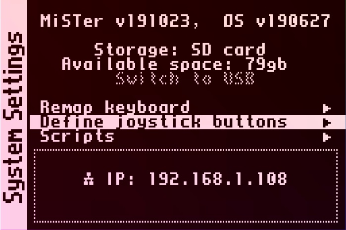

## 3. Define your controller(s)

Next, if you are going to use a gamepad or joystick or other type of game controller, we can define the inputs. Open the OSD on your keyboard with the F12 key. Press F12 again to switch to the secondary OSD menu. You will see an option to "Define joystick buttons". Highlight it and press enter.

First it will ask you to press certain buttons in order to detect your controller. If it asks for a button you don't have press the space key (or the USER button on your IO board) to skip. Then it will ask you to press the button you want to assign to each action. If you mess up, don't worry! You can just do it over again. If you aren't sure about a button, you can skip it and come back to it later.

## 4. Running Downloader to update the MiSTer

Finally, we are going to run downloader.sh to update your MiSTer's system files to their most current version. This is a good idea to do occasionally as the cores and main system are updated frequently with new features and fixes.

Go back into the secondary OSD by pressing F12, just like you did when you defined your inputs. This time highlight "Scripts" and press enter (or A on your gamepad if you defined its inputs). Highlight `downloader` and run it. This will take quite some time, so go make some tea and relax. :)

When it finishes it may either reboot your MiSTer automatically, or it may ask you to press a key or button to continue. Go ahead and press a key to make it reboot if it asks you to.

That's it! Wasn't that easy to update your MiSTer?

## 5. Starting a core and playing a game

On the MiSTer, all of the systems being simulated are called "cores". For example, there is a SNES core which simulates the hardware of the Super Nintendo Entertainment System (or Super Famicom). From the On Screen Display (OSD) highlight `Console` and enter, then highlight `SNES` and enter. This will make the screen go black temporarily while the core loads and your display resyncs.

Next, highlight `Load ROM` and enter. This directory is probably empty. This is because MiSTer does not come preloaded with ROMs, you have to supply those yourself. To load ROMs onto the MiSTer is pretty simple. 

If you are still connected to the network just go to a file explorer (if using a Windows PC) and type `\\MiSTer\sdcard\` in the bar at the top of the window, and press enter. Then you can access the storage just like regular file storage. 

If you are not connected to the network and don't want to, you can alternatively power off the MiSTer, remove the MicroSD, insert it into your computer, and acccess this same folder that way. 

In this "root" folder there is a `games` folder. Enter that one. Inside the `games` folder there is a `SNES` folder. That's where we will put our SNES rom (Super Mario World (USA) in this example) that we want to play.

Now with our ROM loaded onto the MiSTer's storage, let's play it! 

Highlight `Load ROM` again and enter. Now you should see your ROM you transferred on the screen. Highlight it and enter. The game should load successfully.

Loading a different core can be done by switching to the second page of the OSD menu in the SNES core by pressing Right on the gamepad or keyboard. This will reveal a lot more options. `Core` at the top will allow you to change to a different core, `Reboot the mister` at the bottom will allow you to reboot your MiSTer and start from the Menu core again.
